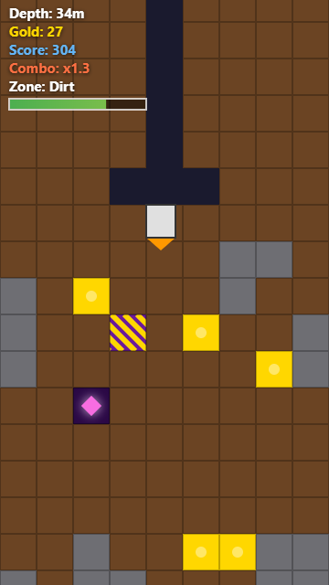

# Endless Core

**[Play it here](https://seantomaslynch-cell.github.io/endless-core/)**

An endless vertical drilling game built with vanilla HTML5 Canvas and JavaScript — no frameworks, no build step, no dependencies.

## Features

- Procedurally generated terrain (Perlin noise) with a guaranteed safe path down
- Three depth-based biomes — Dirt, Ice, and Magma — each with distinct visuals and movement/fuel mechanics
- Hazards: Stone blocks and explosive Gas Pockets
- Collectibles: Gold, Chests (mid-run power-ups), and ultra-rare Relics
- An Artifact Museum and unlockable Drill Classes with different handling and risk/reward tradeoffs
- Daily Contracts with rotating goals and bonus rewards
- Fuel Tank upgrades, combo scoring, screen shake, particles, and procedural sound effects (Web Audio API, no audio files)
- Local run history and lightweight analytics, all stored in `localStorage`

## Running locally

Just open `index.html` in a browser, or serve the folder with any static file server.
